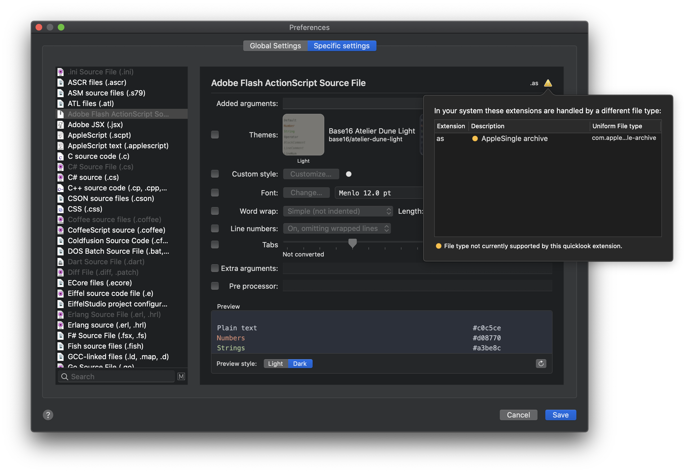
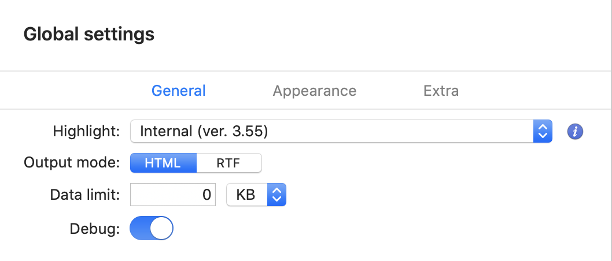
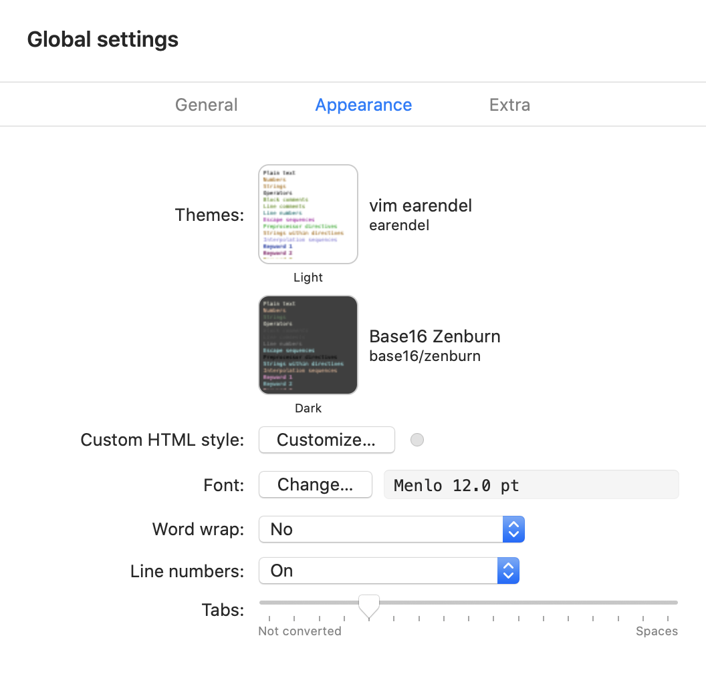
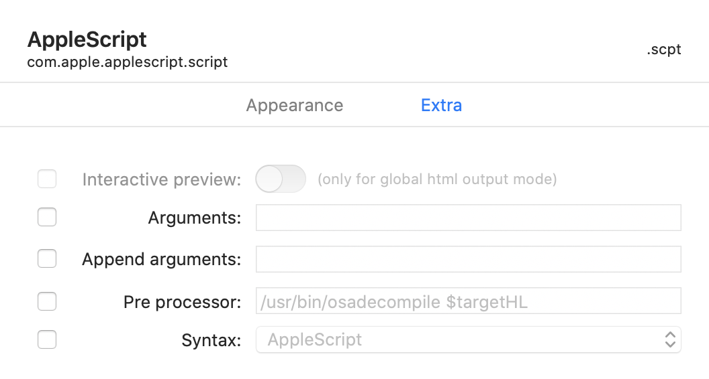

#  Quicklook extension for source files

This application offers a quicklook extension for MacOS 10.15 Catalina or later for previewing source files.
Inside it uses [Highlight](http://www.andre-simon.de/doku/highlight/en/highlight.php) to render source code with syntax highlighting.
The application is distributed with a version of the `highlight`. If you want you can use a different version customizing the preferences.

**Warning: if you have problems with the preview please try to set in the settings the output mode to .rtf**

Starting from MacOS 10.15.0 Catalina the qlgenerator APIs are deprecated. Moreover a .qlgenerator package inside Library/QuickLook must be notarized on 10.15.0 to work. In version 10.15.1 it seems that notarization is no longer required.  

This project consists of these components:

- a standalone app that can view source files and provide the interface for the preferences;
- a quicklook system extension to preview the source files;
- an XPC service that generate the preview of source file and pass the formatted data to the app or the quicklook extension.

MacOS 10.15 Catalina require sandboxed extension that prevent the execution of external processes (like shell script). 
To work around this problem, it is possible to use an XPC service that may have different security policies than the application / extension that invokes it. In this case the XPC service is not sandboxed.

The XPC service is executed automatically when requested by the application or the quicklook extension. After closing the quicklook preview the process is automatically closed after some seconds releasing the resources.

The app and quicklook extension can preview files showing the formatted code as html, inside a WKWebView, or as rtf inside a NSTextView.

To use the quicklook preview you must launch the application at least once. In this way the quicklook extension will be discovered by the system. 
After the first execution, the quicklook extension will be available among those present in the System preferences/Extensions.


This extension don't provide a thumbnail service for the Finder icon. 

SyntaxHighlight is distributed in the hope that it will be useful but WITHOUT ANY WARRANTY.


## File format management

The quicklook extension uses the [Uniform Type Identifier (UTI)](https://developer.apple.com/library/archive/documentation/FileManagement/Conceptual/understanding_utis/understand_utis_intro/understand_utis_intro.html) to handle the supported formats (and not simply the file name extension). 
Inside the definition on an UTI there are the list of extensions and mime type associated with it.

Some file types are directly associated to an UTI by the system. Other formats are registered by the owner application. In this way some extensions can be associated to multiple UTIs based on the applications currently installed. 

For this reason, this application supports many UTIs even if they are apparently redundant. 

_MacOS 10.15 does **not** allow to manage some file formats including (but not limited to):_
- .xml
- .plist
- .html
- .ts 
- .dart
- common images (.jpg, .gif, .png)
- ...

It's likely that I didn't associate all the possible extensions managed by `highlight`.

With the inquiry window you can see if a specific file type is handled by the quicklook extension and also if it is recognized by `highlight`.


On Terminal you can see the UTI of a file with this command: 

```
$ mdls -name kMDItemContentType -name kMDItemContentTypeTree filename.ext
```
If you found an unhandled format please send me the output of above command.
**Only the formats supported by `highlight` can be managed by this application.**

To view the info about `highlight` with the supported file formats and extensions go to the menu `Syntax Highlight/About highlight…`, or in the Preferences window click the *i* info button near the highlight popup button.


## Application preferences

In the standalone app, with the preferences window you can customize the preview settings used by the plugin extension.


The preferences windows has three zones:
- on the left side the list of the supported UTI file format;
- on the center the panel to edit the settings;
- on the right side the preview of current settings.

You can set the settings for all file selecting the _Global_ item on the left list or customize for a specific UTI format.
When you customize the settings of a specific format the global preferences are inherited and you can override only the requested options.

In the list of supported file type the grayout items are those currently managed by others UTI. Clicking on the exclamation mark icon you will show which UTI is used for a given file extension.



The settings are stored in `~/Library/Preferences/org.sbarex.SourceCodeSyntaxHighlight.plist`.
Custom themes and styles are saved in `~/Library/Application Support/Syntax Highlight`.


### General settings


Selecting the _Global_ item on the left list you can set the general settings of the engine:
- *Highlight*: path of the `highlight` utils. You can choose the embedded version or select a different version (compiled by hand or installed with homebrew for example).
- *Output mode*: set the rendering output. Can be _html_ that use the WebKit or _rtf_ that use a NSTextView.
- *Data limit*: maximum amount of data to format, data beyond the limit is omitted. Specify 0 to not limit.
- *Debug*: enable the generation of the _colorize.log_ and _colorize.html|rtf_ on your desktop for debug purpose.

### Appearance settings


This section allow to customize the appearance of the rendered source files:
- *Themes*: You can choose a theme for light and dark style of the MacOS.
- *Custom style*: for _html_ output mode you can set a custom css style to override the theme settings. 
- *Font*: font family and size to use in the output. Depending on the theme chosen, italic and bold style may be applied to certain elements. 
- *Word wrap*: handle the style of the work wrap.
- *Line number*: you can set the visibility of the line numbers.
- *Tabs*: set if the tabs must be converted to space. Setting to zero disable tabs conversions.

### Extra settings


This section allow to customize extra advanced settings:
- *Interactive preview*: if the global output option is set to _html_ enable javascript inside the preview windows. Use only if you use some `higlight` plugins that embed js code inside the output.
- *Arguments*: extra arguments for the `highlight` executable. Arguments that contains a white space must be protected inside queted.
- *Append arguments* (only for custom UTI settings): allow to set extra arguments to be appended to the global arguments.
- *Pre processor* (only for custom UTI settings): set a program or a shell script to preprocess the source file before the formatting. The program must output to stdout the data to be passed to `highlight`. You **must** pass the name of the source file using the `$targetHL` placeholder. With the preprocessor you can handle file format not directly supported by `highlight`.
- *Syntax* (only for custom UTI settings): set which language must be used to recognize the source file. If not set will be used the file name extension to recognize the format. 

Some file format have a preconfigured custom settings to handle the data (for example java compiled class file can be decompiled before render).

### Preview
The preview panel show an example of the output with the current settings.
You can show the single theme color items or test the output with some example source files.
You can also browse for a custom file to test the preview.


## Theme editor
The application has a gui theme editor accessible form menu `View/Themes editor`. 
With this interface you can create a custom theme to use with `highlight`.


Standard themes provided by `highlight` cannot be edited but can be duplicated and then customized.

Clicking on an element of the preview blinks the corresponding item in the editor and vice versa.

Customized themes are saved in `~/Library/Application Support/Syntax Highlight/Themes`.


## Note for download precompiled release
The [precompiled app](https://github.com/sbarex/SourceCodeSyntaxHighlight/releases) is not notarized or signed.
When you download the precompiled app you must strip quarantine flag.
You can launch the app with right click (or ctrl click) on the app icon anche choosing the open action.
Also you can execute this command from the terminal:

```
$ xattr -r -d com.apple.quarantine "FULL PATH OF THE Syntax Highlight.app (you can drag the file to get the pull path)" 
```

This must resolve the error of damage application when launch the app.

## Note for developers
After cloning remember to fetch submodules:

```
$ git submodule init 
$ git submodule update
```


## Credits

This application has originated from the [anthonygelibert/QLColorCode](https://github.com/anthonygelibert/QLColorCode).
