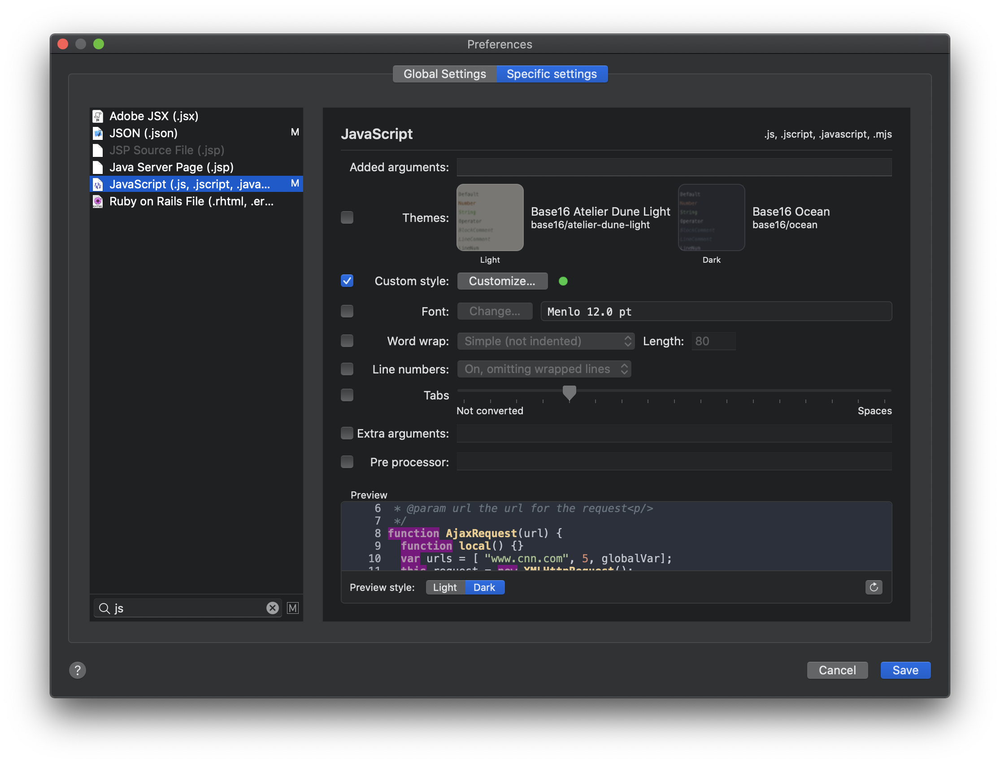

#  Quicklook extension for source files

This application offers a quicklook extension for MacOS 10.15 Catalina for previewing source files.
It's based on the [anthonygelibert/QLColorCode](https://github.com/anthonygelibert/QLColorCode).
Inside it uses [Highlight](http://www.andre-simon.de/doku/highlight/en/highlight.php) to render source code with syntax highlighting.
The application is distributed with a version of the `highlight`. If you want you can use a different version customizing the preferences.

MacOS 10.15 Catalina has deprecated the qlgenerator APIs. Moreover a .qlgenerator package inside Library/QuickLook must be notarized on 10.15.0 to works. In version 10.15.1 it seems that notarization is no longer required.  

This project consists of these components:

- a standalone app that can view source files and provide the interface for the preferences;
- a quicklook system extension to preview the source files;
- an XPC service that generate the preview of source file and pass the formatted data to the app or the quicklook extension.

MacOS 10.15 Catalina require sandboxed extension that prevent the execution of external processes (like shell script). 
To work around this problem, it is possible to use an XPC service that may have different security policies than the application / extension that invokes it. In this case the XPC service is not sandboxed.

The XPC service is executed automatically when requested by the application or the quicklook extension. After closing the quicklook preview the process is automatically closed after some seconds relasing the resources.

The app and quicklook extension can preview files showing the formatted code as html, inside a WKWebView, or as rtf inside a NSTextView.

To use the quicklook preview you must launch the application at least once. In this way the quicklook extension will be discovered by the system. 
After the first execution, the quicklook extension will be available among those present in the System preferences/Extensions.


This extension don't provide a thumbnail service for the Finder icon. 


## File format management

On MacOs every file extension is associated to an [Uniform Type Identifier (UTI)](https://developer.apple.com/library/archive/documentation/FileManagement/Conceptual/understanding_utis/understand_utis_intro/understand_utis_intro.html). Some files are directlly assocated to an UTI by the system. Other format are registered by the owner applications. In this way some extensions can be associated to multiple UTIs based on the applications currently installed. 

For this reason, this application supports many UTIs even if they are apparently redundant. 

Apparently the operating system does not allow to manage some file formats including (but not limited to) .xml, .plist, .html, .ts, .dart.


## Application preferences

In the standalone app, with the preferences window you can customize the preview settings used by the plugin extension.


Some `highlight` features, such as theme, words wrap, line numbers and tabs, are managed through the preferences gui. It is also possible to choose a different theme when OS use light or dark style.

In addition to the global settings for all supported file formats, you can set specific settings for individual file formats.



In the file type Specific settings, there is a list of all file types supported by the quicklook extension.
In this list the grayout items are those urrenty managed by others UTI. Clicking on the exclamation mark icon you will show which UTI is used for a given file extension.


## Note for developers
After clone remeber of fetch submodules:

```
$ git submodule init 
$ git submodule update
$ cd lua4swift
$ git checkout
```
